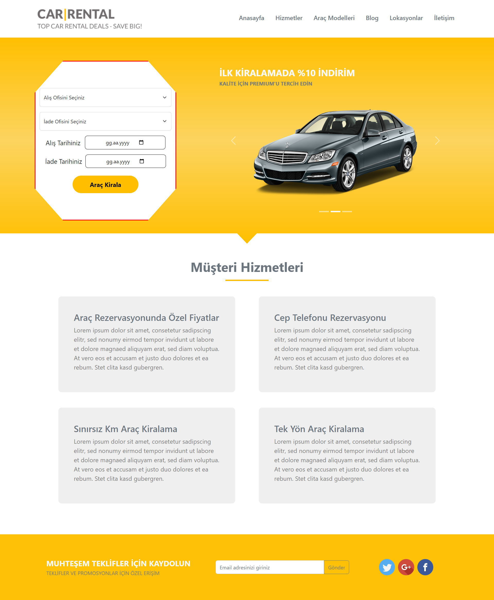
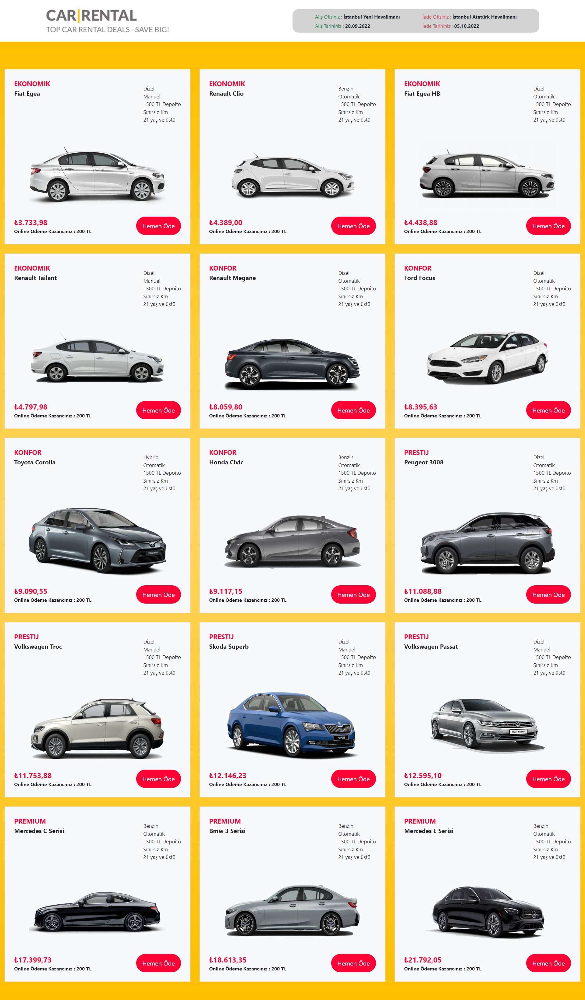
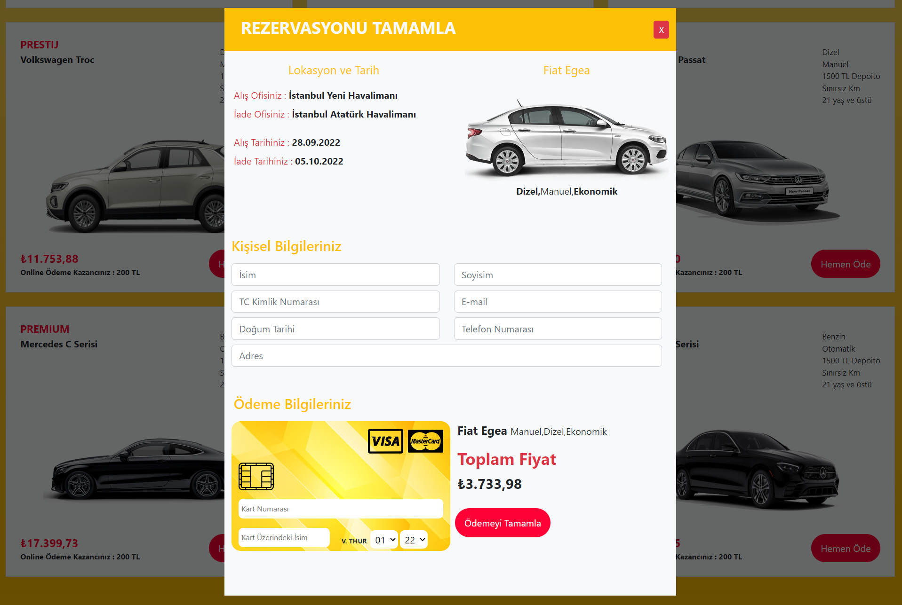

# About The Project

A car rental site using ReactJS and Bootstrap. For example, Avis.com.tr works on the same system as Garenta.com.tr applications. A price is determined in the system according to the selected purchase office, return office, purchase date and return date. The determined price is reflected to the end user according to the vehicle features and class. A new page opens with user information and credit card information depending on which car the user has chosen. The information entered by the user is stored to be sent to the necessary units.
React, Css and Bootstrap are used in the project. Vehicle information is kept as an array in 'carSelectionPage.js'. The prices shown to the user are formatted with the 'react-intl' library.

## Images

### Home Page

### Car Page

### Payment Page

## Start The Project

For installing 'npm' files in the project
### `npm install`

To get the project up and running
### `npm start`

## Languages and Libraries

<li>CSS
<li>Bootstrap
<li>Javascript
<li>ReactJS

## Contact

Oğuz Adıgüzel [Linkedin](https://www.linkedin.com/in/oğuz-adıgüzel-2672a8242). - oguz_adiguzel@outlook.com

Project Link : [https://github.com/oguz-adiguzel/Car-Rental](https://github.com/oguz-adiguzel/Car-Rental).

